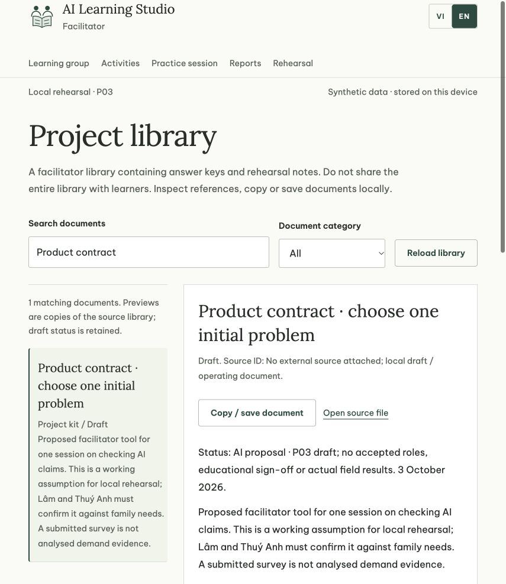

# Lớp thực hành AI · AI Learning Practice

Bộ công cụ local dành cho người hướng dẫn thiết kế và diễn tập việc học có AI: giao diện VI/EN, ba bài học nháp, thư viện 54 tài liệu song ngữ, phiên học tám bước, hồ sơ bài làm và bàn ghi quan sát/readiness. Checkout review WEB02 hiện có hướng thiết kế UI05, reference dossier R04 và các sửa control hiện hành; mười khu giữ vai trò diễn tập rõ ràng. [English README](README.en.md).

**Phạm vi: diễn tập người lớn với dữ liệu giả.** Chưa được phê duyệt sử dụng với trẻ, chưa có kết quả hiệu quả giáo dục tại Việt Nam và chưa là dịch vụ production. Preview người học chỉ ẩn công cụ người hướng dẫn; không có xác thực hay phân quyền bảo mật. AI hiện dùng fixture cố ý có lỗi, không gọi model/API trả phí.

## Edition và kiểm chứng hiện tại

Bản làm việc local và bản HTTPS đã triển khai là hai trạng thái cần phân biệt. Bản nguồn này tích hợp các sửa control đã nghiệm thu và Dream journey ngày 07/10/2026 để commit/push. Việc deploy là bước riêng; link Vercel dưới đây không tự xác nhận bytes của commit mới. Manifest/bundle được sinh từ nguồn đã review và kiểm lại; receipts cũ chỉ giữ giá trị lịch sử. Font Be Vietnam Pro/Lora local giữ nguyên bytes đã commit và SIL OFL, không thay bằng fallback hay tải CDN.

Từ project cha, `./start-current.command public` mở bản này riêng ở 8885. Từ checkout này, dùng launcher cũ với `AI_LEARNING_PORT=8885 ./start-local.command`. Đừng chép toàn bộ runtime public vào original research app: chúng có logic/đường bàn giao riêng.

## Dream journey trong repository

Mở [Xưởng giấc mơ VI](app/dream/index.html?lang=vi) / [EN](app/dream/index.html?lang=en) qua HTTP, hoặc chọn entry ở overview/guide. [Kit song ngữ](app/dream/kit/index.html) gồm11 phần, tám tình huống tổng hợp và phiếu quan sát trống. Ba chặng kể → xem lại/dựng → nhìn lại/sửa giữ nguyên văn và nguồn metadata; lời phương pháp không tự thành tên/lời tác phẩm. Bản public static luôn OFF, không gọi API. Mã server/provider đã chuẩn bị được version riêng trong [source-only backend](source/dream-backend/README.md), mặc định OFF và không nằm trong website/upload Vercel. [Protocol nguồn và giới hạn](docs/dream/README.md). Bộ ZIP cùng tên WEB02 được cập nhật chứa xưởng/kit; không chứa backend hoặc dữ liệu phiên.

## Gửi cho người khác xem

[Ứng dụng web](https://thuy-anh-ai-learning.vercel.app/#overview) · [Hướng dẫn reviewer](https://thuy-anh-ai-learning.vercel.app/#guide) · [Bài LES-02 · EN](https://thuy-anh-ai-learning.vercel.app/#library?doc=MAT-04&lang=en) · [Nguyên bộ review ZIP](https://thuy-anh-ai-learning.vercel.app/downloads/project-review-WEB02.zip).

WEB02 bổ sung tổng quan, đường đọc sâu thư viện và phiếu góp ý JSON local. Gửi link xem ngay hoặc tải nguyên bộ app +108 tài liệu authored để diễn tập offline; corpus toàn văn bên thứ ba và dữ liệu browser không nằm trong ZIP. Phiếu góp ý JSON là export để chủ động gửi, chưa có server nhận/import/merge hay shared account. Mỗi browser/origin giữ state riêng; đổi ngôn ngữ không dịch câu trả lời người dùng. Xuất backup trước khi đổi origin; review JSON không phải backup học viên. [Protocol bàn giao và checksum](docs/SHARING-WEB02.md).

## Chạy trên máy

Cần Python 3.10+; Node.js 18+ chỉ cần cho tests. Không cài thư viện để chạy ứng dụng hoặc bộ kiểm public.

```sh
python3 -B -m http.server 8875 --bind 127.0.0.1 --directory app
```

Mở [ứng dụng local](http://127.0.0.1:8875/). Hoặc chạy `./start-local.command` (macOS/Linux); `AI_LEARNING_PORT=8876` để đổi cổng. Toggle VI/EN ở đầu trang ghi nhớ lựa chọn. Dữ liệu người dùng lưu trong localStorage của trình duyệt; xuất backup trước khi đổi máy/origin hoặc thử import. Không đưa bản backup thật, dữ liệu trẻ, khóa API hoặc quan sát cá nhân lên GitHub.

## Kiểm bản public

```sh
python3 -B tools/check_public.py
```

Bộ kiểm còn xác nhận ZIP authored review đã rebuild đúng nguồn bằng `tools/build_share_bundle.py --verify`; source đổi mà quên rebuild phải FAIL.

Bộ kiểm này xác nhận dấu vân tay của **file đang được phân phối**, nguồn/copy học liệu, link local, metadata dịch, Python fault tests, Node app tests, hai benchmark offline và provider config chưa kích hoạt. `PUBLIC-MANIFEST.json` là receipt kiểm tính toàn vẹn, không chữ ký, không chứng minh chất lượng sư phạm. Sau thay đổi có chủ đích và review, cập nhật receipt bằng `python3 -B tools/create_public_manifest.py`, rồi chạy lại bộ kiểm.

**Toàn văn nghiên cứu không được tái phân phối.** `research/` chỉ có URL, metadata, claim trích ngắn và hashes của capture lịch sử. Các đường dẫn snapshot/fulltext trong metadata trỏ đến corpus lưu riêng, không phải file có sẵn trong repo public. Trạng thái capture lịch sử không đồng nghĩa corpus có trong bản này. Bộ kiểm public luôn ghi `fullCaptureProvenance: UNAVAILABLE` và thực thi verifier strict nguyên bản để cho thấy nó thất bại khi thiếu corpus.

`tools/check_all.py`, `verify_research.py`, `verify_project_kit.py`, compiler và packager strict vẫn giữ nguyên. Chúng yêu cầu corpus hợp pháp đúng hash được khôi phục thủ công tại các đường dẫn đã ghi; không có tải lại tự động, không tạo dữ liệu giả để vượt gate. App có `app/resources/` đã biên dịch nên chạy được mà không có corpus. Không gọi `build_resources.py` trong quickstart public khi thiếu corpus. [Phạm vi nguồn và quyền](PROVENANCE.md).

## Triển khai Vercel

Cấu hình `vercel.json` dùng preset Other, bỏ install/build command và chỉ phục vụ thư mục `app/`. `.vercelignore` chỉ cho phép app + config vào deployment; tests, README/package của app, manifest compiler và toàn bộ nguồn/tooling/research ngoài app bị loại. Font và giấy phép OFL vẫn đi kèm. Không cần env, API key hoặc backend.

Từ thư mục gốc repo, với Vercel CLI đã cài và đăng nhập đúng tài khoản/scope:

```sh
vercel link
vercel --dry --json
vercel --prod
```

Chọn đúng project/scope khi link. Xem inventory dry-run trước khi deploy; `.vercel/` là trạng thái máy riêng, được bỏ qua bởi git và public receipt. Lệnh production tạo URL HTTPS; kiểm index, module, font và library VI/EN sau deploy, đồng thời xác nhận `/tests/`, `/research/`, `/tools/` không được phục vụ. Thay origin sang Vercel không chuyển localStorage từ localhost; dùng backup synthetic nếu cần diễn tập. Hosting không bổ sung tài khoản, live AI hay quyền chạy pilot với trẻ. Hướng dẫn cấu hình: [Vercel static configuration](https://vercel.com/docs/project-configuration/vercel-json).

## Đường hoàn thiện

Chốt product contract giữa người chịu trách nhiệm; chuyên gia giáo dục review LES-02; người hướng dẫn độc lập diễn tập; quyết định dữ liệu/consent và xử lý sự cố; chỉ sau đó quyết định pilot, live AI và vận hành production. Các template, đề xuất độ tuổi/thời lượng/rubric và nội dung kênh vẫn là nháp. Review/readiness do người tự nhập trên máy không xác thực danh tính, không tự cấp phê duyệt.

[Kho tài liệu](materials/README.md) · [Bài học](materials/curriculum/README.md) · [Tài liệu ứng dụng](app/README.md) · [Benchmark](benchmarks/EVALUATION_GUIDE.md)

Public visibility không tự chọn license phần mềm. Chưa cấp MIT/Apache hoặc quyền tái sử dụng riêng cho code/tài liệu dự án; xem [LICENSE.md](LICENSE.md). Các font đi kèm giữ nguyên SIL OFL và thông báo copyright riêng.


